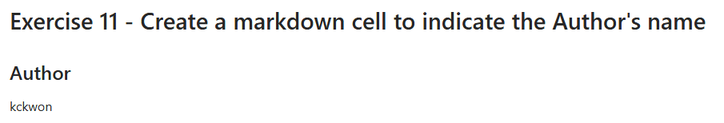

# testrepo

## Editing the file

It's a markdown file in this repository.

-- tag & message
git tag -a r20250806v4 -m "release 2025-08-06 v4"

-- push a specific tag
git push origin r20250806v4

-- push all tags
git push origin --tags

2025-08-06 edit 5 v4